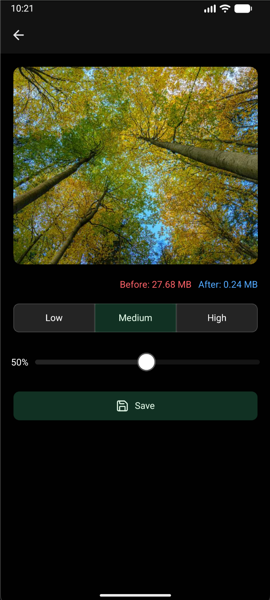

Toolbox App

A multifunctional React Native app that provides useful tools such as image compression, file management, and more — all in one place.

🚀 Features

List what your app currently does and what you plan to add:

🖼️ Image Compressor — Compress images with adjustable quality levels (low, medium, high)

💾 Local Save Support — Save compressed images to device storage

📷 Gallery Access — Pick images from the device gallery

🔔 In-App Notifications — Show success/error messages using Notifier

🧩 Cross-Platform — Works on Android and iOS

🧠 Planned Tools:

PDF compressor

File converter (image ↔ PDF, etc.)

Audio trimmer

QR code generator

🛠️ Tech Stack

React Native (Expo)

TypeScript

Tamagui (for UI)

Zustand (for state management)

react-native-compressor

expo-media-library

react-native-notifier

## 📱 Compress Screen

  
